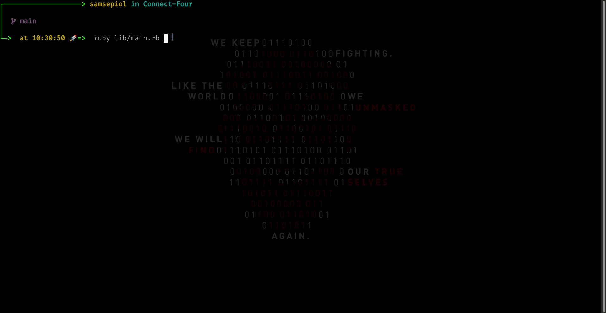

# [Connect-Four](https://en.wikipedia.org/wiki/Connect_Four)

<details open="open">
  <summary>Table Of Contents</summary>
  <ol>
    <li>
      <a href="#description">Description</a>
    </li>
    <li>
      <a href="#demo">Demo</a>
    </li>
    <li>
      <a href="#built-with">Built With</a>
    </li>
     <li>
      <a href="#play-online">Play Online</a>
    </li>
    <li>
      <a href="#play-local">Play Local</a>
    </li>
     <li>
      <a href="#what-i-learned">What I Learned</a>
    </li>
     <li>
      <a href="#acknowledgements">Acknowledgements</a>
    </li>
  </ol>
</details>

## Description

<Description>

## Demo

<!--  -->
</br>
  
## Built With
* Ruby
* RSpec

## Play Online

[Replit](#)

## Play Local

### Prerequisites

You need to have Ruby installed locally. If you don't have, use [this](https://www.theodinproject.com/paths/full-stack-ruby-on-rails/courses/ruby-programming/lessons/installing-ruby-ruby-programming) to install Ruby first.

### nstallation

```sh
git clone git@github.com:Maheshkumar-novice/connect-four.git
```

```sh
cd Connect-Four
```

```sh
ruby lib/main.rb
```

## What I Learned

- <What>

## Acknowledgements

* [The Odin Project](https://theodinproject.com)
* [Replit](https://replit.com)

[Move To Top](#connect-four)
